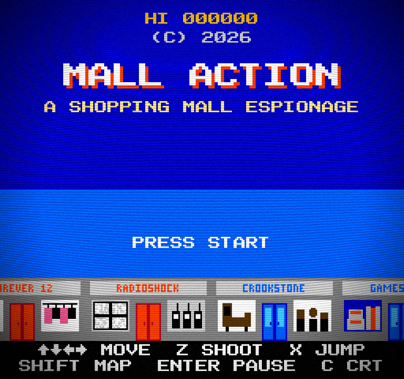
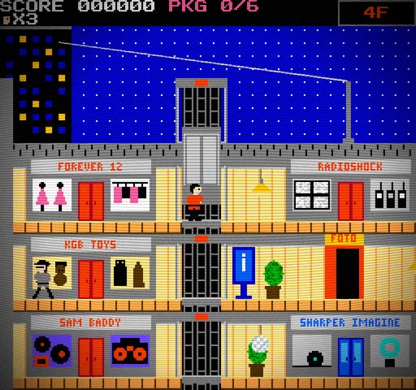
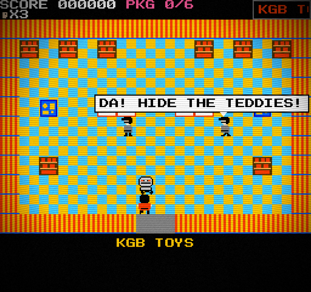
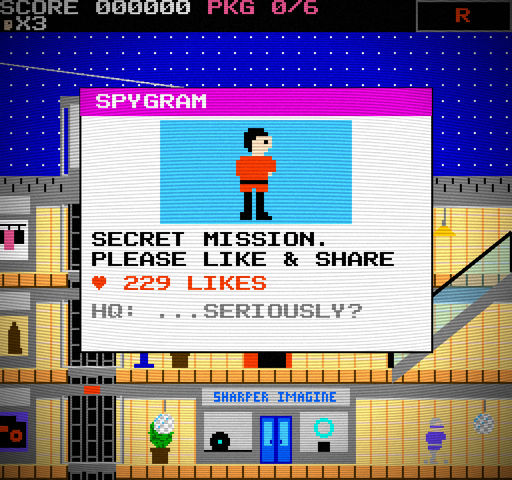

# MALL ACTION

**▶ [Play it in your browser](https://rlorca.github.io/mall-action/)** · a FLICKERSOFT game

**An 8-bit spy caper in an 80s shopping mall.** A spiritual successor to Taito's *Elevator Action* (1983) that you can play in the browser. Zip-line onto the roof, ride the elevators, drop the lights on enemy spies, and search the stores for six secret packages. Then make it down to the parking garage before the alarm goes off.

<p align="center">
  
  
</p>
<p align="center">
  
  
</p>

## The pitch

The spies have hidden six packages somewhere in the mall. You're the agent sent to get them back.

- **The mall is a side-scroller**, like *Elevator Action* and *Keystone Kapers*. It has six floors, three elevator shafts and two escalators, with spies coming out of every door.
- **The stores are top-down**, like *Zelda*. Walk into a red door, search the racks and shelves, and deal with the guards.
- **Red doors hide the packages.** Collect all six, then take the elevator down to **P** and drive off in the wood-panelled station wagon.

## Features

- **Everything an *Elevator Action* fan expects.**
  - A zip-line entrance from the building next door.
  - Red target doors.
  - Duck-and-jump gunfights.
  - Shooting out the lights to drop them on spies.
  - Crushing spies with the elevator car.
  - The rule that you can't leave until you have every package.
- **13 parody stores**, each with a window display that shows what it sells: Forever 12, RadioShock, KGB Toys, Hot Spy on a Stick, Foot Lockpicker, Sam Baddy, GameStonk and more.
- **A song for every store**, a quiet ambient bed for the mall, and a muzak version in the elevators.
- **Power-ups**, including food-court specials: Rapid Fire, Spread Shot, Armor, Sneakers, Radar, a Cinnabomb, an Orange Juli-Ooze and a Soft Pretzel.
- **A living mall.**
  - The janitor leaves slippery wet floors.
  - Retirees power-walk the corridors (don't shoot them).
  - A mall cop on a Segway takes an interest when you open fire.
  - Directory kiosks, a photo booth and fountains full of coins.
- **Jokes everywhere.**
  - SPYGRAM selfies when you arrive and when you finish.
  - PA announcements.
  - Spies with last words.
  - Guards who really didn't expect you.
  - A newspaper front page when you clear the level.
- **A map screen** (Select), a pause screen, 3 continues, harder loops after each clear, and a CRT-monitor filter you can switch off.
- **Secrets.** There's a famous code for the title screen. And someone at GameStonk wants to give you something.

All the pixel art, the font, the music and the sound effects are generated in code. The project has **no asset files**.

## Play

```bash
npm install
npm run dev
```

Open <http://localhost:5173>. It runs in any modern desktop browser with WebGL.

Every push to `main` is tested, built and published to GitHub Pages by [`.github/workflows/pages.yml`](.github/workflows/pages.yml).

### Controls

| Action | Keyboard | Gamepad |
|---|---|---|
| Move | Arrows or WASD | D-pad / left stick |
| Shoot | Z or J | A |
| Jump (mall) / Search (store) | X, K or Space | B |
| Enter a store, board an elevator, call an elevator, use a kiosk or photo booth | Up | Up |
| Map | Shift or Tab | Select |
| Pause | Enter | Start |
| CRT filter on/off | C | |
| Sound on/off | M | |

Letter keys follow the letter printed on the key, so QWERTZ and AZERTY keyboards work out of the box.

### Tips

- Duck under high shots and jump over low ones. A spy strikes an aiming pose just before firing.
- Shoot a hanging lamp to drop it on whoever is underneath. On 2F the lamps are disco balls, and they roll.
- A spy waiting in an elevator doorway is a spy waiting to be crushed.
- Stand still by an elevator shaft to call the car. Falling more than one floor down an empty shaft will kill you.
- Kiosks point you to the nearest package. Radar marks packages on the map.
- Take too long and the mall alarm goes off.

## Development

```bash
npm test          # 300+ unit tests (Vitest)
npm run build     # production build in dist/
npm run preview   # serve the build
```

These URL parameters help with debugging:

| Param | Effect |
|---|---|
| `?seed=123` | Fixed random seed, so a level plays the same every time |
| `?debug=1` | Exposes `window.__mall` and a frame-stepping driver: `__mall.drive(['right'], 60)` |
| `?gallery=1` | Browse every sprite in the game (Start pages through) |

`tools/shot.mjs` drives the game in headless Chrome and takes screenshots. It's how the game was play-tested.

### How it's built

- [Vite](https://vitejs.dev/), vanilla ES modules and [PixiJS 8](https://pixijs.com/) for rendering. The CRT effect uses [pixi-filters](https://github.com/pixijs/filters).
- The game runs at a fixed 60 Hz on a 256×240 NES-sized screen, scaled up in whole-pixel steps.
- The game rules are plain JavaScript with no rendering code, so the tests cover most of the game without a browser. That includes physics, elevators, spies, stores, power-ups, scoring and the jokes.
- Sprites are written as pixel grids in code. Music is written as note strings and played by a small WebAudio synth modelled on the NES sound channels.

```
src/core     loop, input, rng, scene manager
src/audio    WebAudio synth, music, sound effects
src/gfx      palette, fonts, sprites (as code)
src/world    mall layout, store rooms, level setup
src/logic    pure rules: physics, elevators, scoring, power-ups, NPCs, secrets
src/game     mall and store simulation, jokes (humor.js)
src/scenes   title, mall, store, map, pause, continue, level clear, game over
src/flickersoft  the FLICKERSOFT boot logo, shared by all FLICKERSOFT games
tests        Vitest specs
docs         design spec and implementation plan
```

Want to add a joke? Every line lives in [`src/game/humor.js`](src/game/humor.js) and [`src/game/storeExtras.js`](src/game/storeExtras.js), and the tests check that each line fits on screen.

## Disclaimer

*Mall Action* is made by **FLICKERSOFT**. It is a fan-made homage. It is not affiliated with or endorsed by Taito or any of the brands its stores parody. All store names are jokes, and all trademarks belong to their owners.
