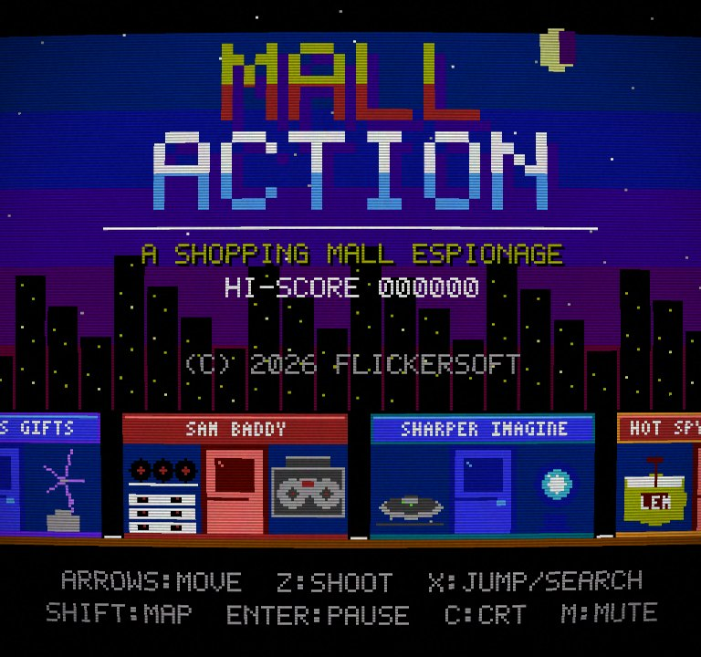
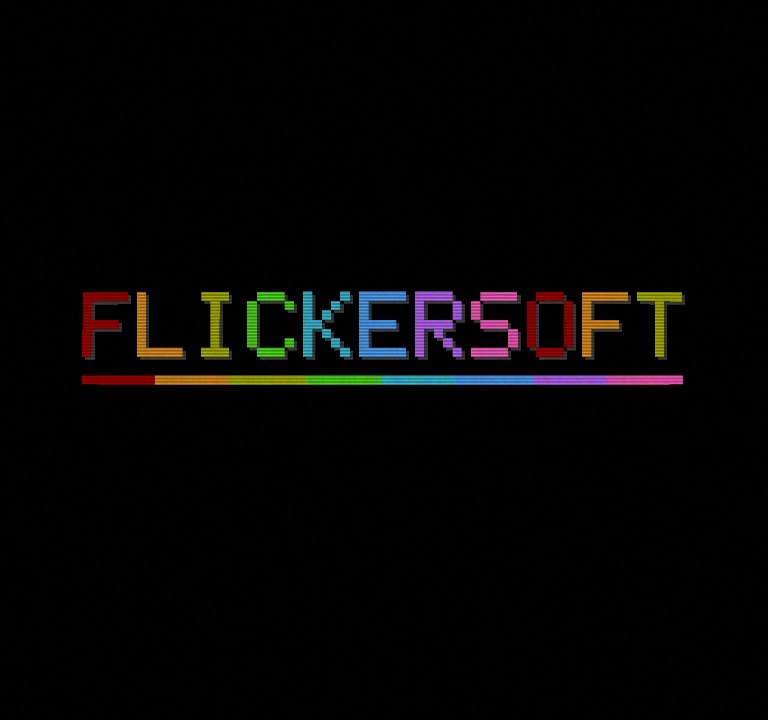
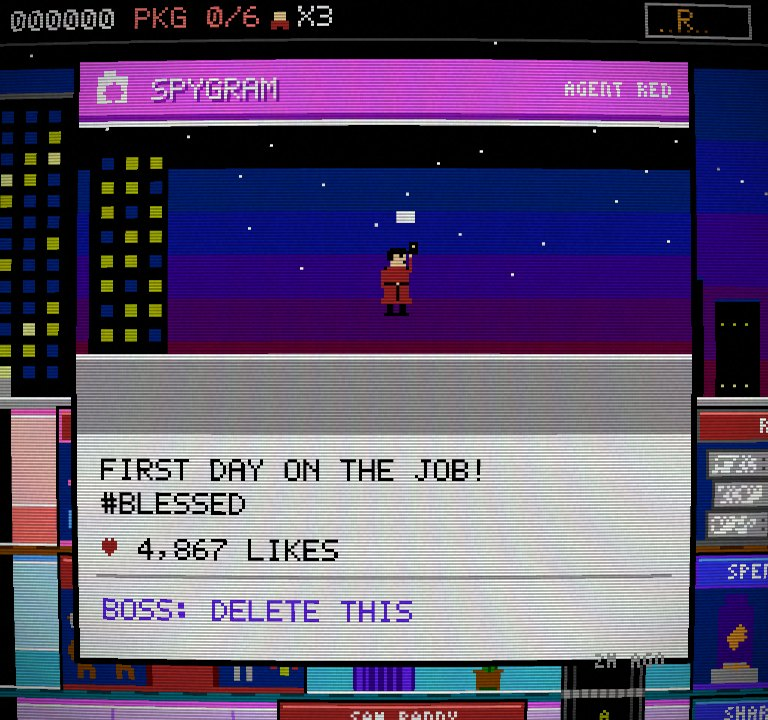
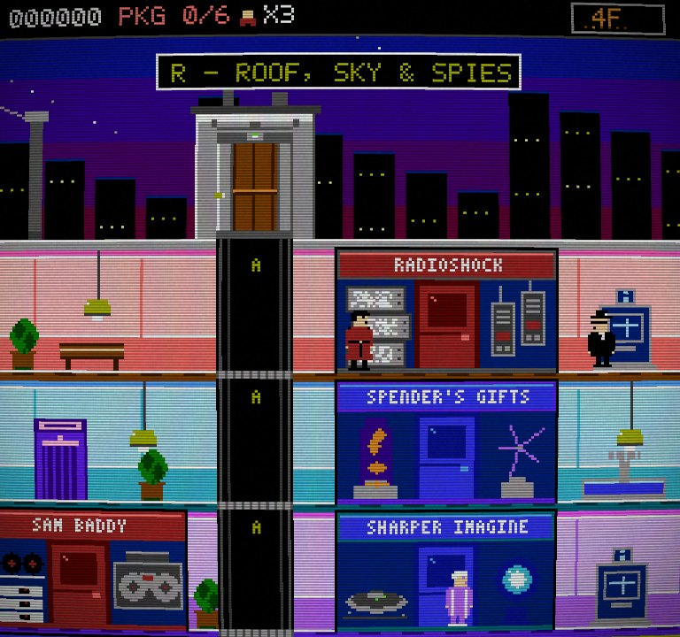
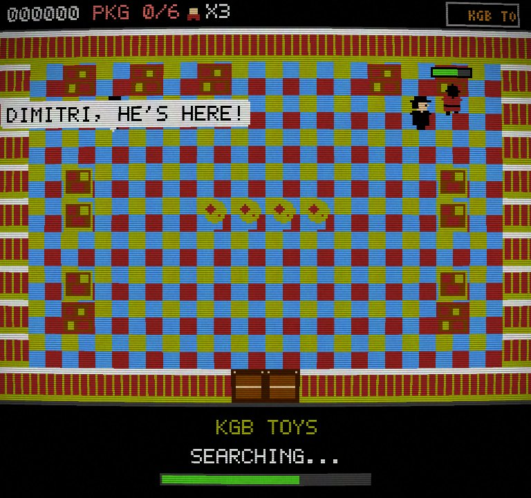
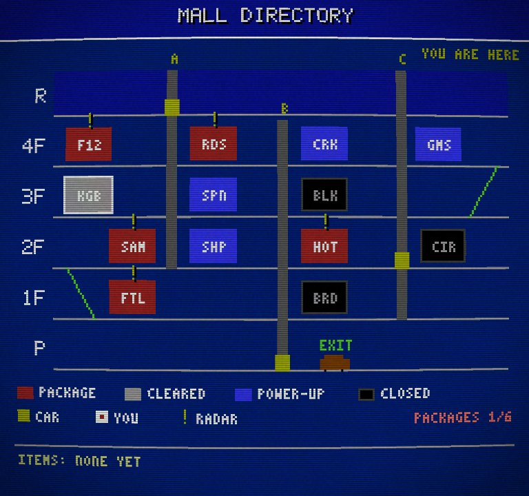
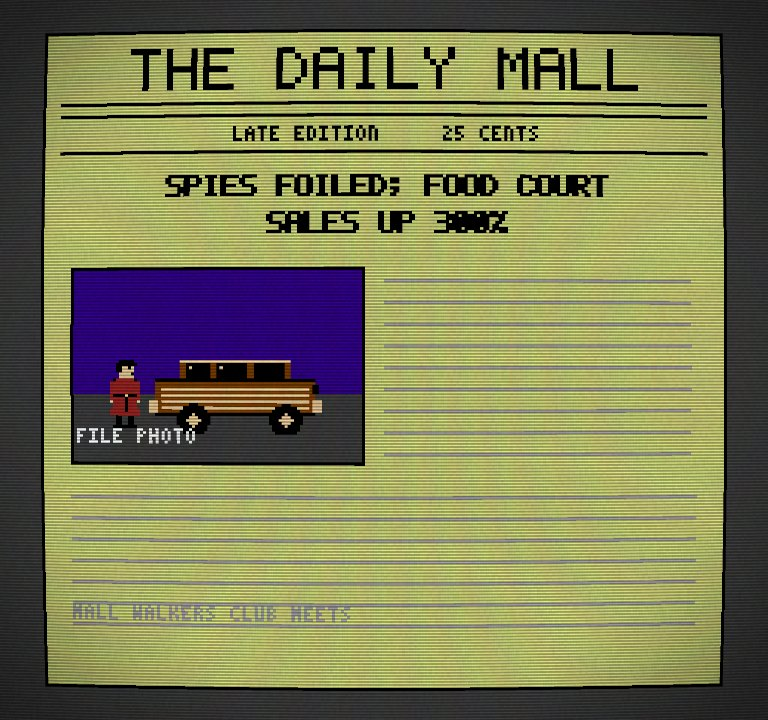

# MALL ACTION

**A SHOPPING MALL ESPIONAGE** - an 8-bit spy caper set in a big 1980s shopping mall, by the (fictional) studio **FLICKERSOFT**.

It is a spiritual successor to *Elevator Action*: you are a trench-coated agent who zip-lines onto the mall roof, rides
elevators and escalators, gunfights spies coming out of shop doors, and walks into stores that switch to a top-down,
*Zelda*-style room where you search racks, shelves and fitting rooms for hidden **packages**. Collect all 6, ride down
to the parking level and drive off in the wood-panelled station wagon. Then the next loop starts, harder.

Everything - every sprite, tile, font glyph, song and sound effect - is generated from source code. No image or audio
files are shipped.

> **Play in your browser:** <https://rlorca.github.io/mall-action/sonnet-5.5-opus-5.5/>

| | | |
|:--:|:--:|:--:|
|  |  |  |
|  |  |  |
|  | | |

*(Screenshots are taken with the default CRT effect ON.)*

## Features

- **Side-scrolling mall**: 768 px wide, 6 floors (R, 4F, 3F, 2F, 1F, P), three elevator shafts (A: R-2F and B: 4F-P are
  driven by you, C: R-1F runs on a timer), two escalators, 13 parody storefronts whose windows show what they sell.
- **Elevators done properly**: gliding to the next floor when you let go, exactly one *ding* per stop, grates, open pits,
  roof riding, crushing (spies too), and cars that come when you stand beside the opening.
- **Spies** with a fair telegraph (half-second aim pose), first-shot delay, and a 10% chance to duck. The mall is full
  of other people: a janitor with a wet-floor sign, two mall walkers who block bullets, a mall cop on a Segway.
- **10 stores in top-down view**, each with its own hand-designed layout, theme (9 themes), song and first-visit
  jokes: fitting rooms that hide shrieking spies, toy shelves that release wind-up toys, a listening booth with a
  bonus track, and the *GameStonk* "IT'S DANGEROUS TO GO ALONE!" cave.
- **9 power-ups** (rapid fire, spread shot, armor vest, sneakers, radar, 1-up and three foods) with timers that keep
  running inside stores.
- **FLICKERSOFT splash**, **SPYGRAM** selfies, **THE DAILY MALL** front pages, a mall PA, a map ("MALL DIRECTORY"),
  continues, game over with falling shutters, a Konami code (try it on the title screen), loops that get harder.
- **Chiptune audio** synthesised in the browser on NES-style channels (2 pulse, triangle, noise): one song per store,
  a quiet ambient bed in the mall, an alarm groove, and an elevator-muzak arrangement of the title theme.
- **CRT effect** (scanlines, mild curvature, vignette, noise) in a WebGL shader, ON by default. Integer scaling, no blur.

## Controls

| Action | Keyboard | Gamepad |
|---|---|---|
| Move | Arrows, WASD | D-pad, left stick |
| **A**: shoot | Z, J | A (button 0) |
| **B**: jump (mall), search (store) | X, K, Space | B (button 1) |
| **Select**: map | Shift, Tab | Select (button 8) |
| **Start**: pause, confirm | Enter | Start (button 9) |
| CRT on/off | C | |
| Mute | M | |

Letter keys match the **printed letter**, so QWERTZ and AZERTY layouts work; other keys match by physical position.

In the mall **Up / Down** do the contextual thing: enter a store at its door, board or call an elevator, step on an
escalator at either end, use a kiosk or the photo booth, or use the getaway car. In a store, **a single tap of B
starts a search** that runs by itself (any fixture you are touching counts); shooting or pressing another direction cancels it.

## Tips

- The first stop is **4F**: ride shaft **A** down from the roof. FOREVER 12 and RADIOSHOCK are right there.
- Hold **Down** to duck: a spy's high shot goes over you. Jump to dodge a low one.
- Stand next to an elevator opening for half a second and the car comes to you. A car you *called* will not crush you; any
  other car coming down onto a grate will. Spies standing on grates can be crushed for 300 points.
- Shoot hanging lamps (300 points if a spy is underneath) and the **fountains** (coins - and once in a while a gold one).
  A disco ball on 2F rolls and flattens everything in its path.
- Do **not** shoot in front of the mall cop, or the mall walkers.
- Kiosks point at the nearest package. The Radar power-up flags package fixtures and shows "!" on the map.
- Watch the clock: you get a time bonus of 10 points per second under 300 s, and the alarm sounds after ~150 s.

## Run, test, build

```sh
npm install
npm run dev        # dev server (Vite) with hot reload
npm test           # the Vitest suite (rules, art, copy, a scripted full playthrough ...)
npm run build      # type-checks, then builds static files to dist/ (relative URLs: works under any sub-path)
npm run preview    # serve dist/
```

URL options (also handy for automated playtests):

| URL | Effect |
|---|---|
| `?seed=N` | fixes the random seed (a seed always replays the same) |
| `?debug=1` | skips the studio splash and exposes `window.__game` (`step(n, held)`, `pause()`, `render()`, the `game` object ...) |
| `?gallery=1` | shows every sprite, animated (Left/Right to change page) |
| `?crt=0` / `?crt=1` | force the CRT effect off / on for this visit |
| `?webgl=0` | pretend WebGL is missing, to see the fallback message (the game still runs, without the CRT effect) |

Example: `window.__game.pause(true); __game.step(60, { right: true });` steps the simulation 60 frames holding Right.

## Project layout

```
src/core/        the game RULES - pure TypeScript, no DOM, no rendering (all timings in 60 Hz frames)
  copy.ts          EVERY line of text: jokes, banners, headlines, store names, UI labels (tests check they fit)
  level.ts         the mall's geometry (floors, shafts, escalators, storefronts, furniture, lamps)
  mall.ts          the side-scrolling world: player, cars, bullets, lamps, pick-ups, hazards, alarm, PA
  mall-spies.ts    spy spawning, AI, aiming, dying      mall-npcs.ts  janitor, mall walkers, mall cop, wet floor
  elevator.ts      car physics: gliding, dings, openings (grate / pit / here), calling
  store.ts         the top-down store rooms: searching, guards, toys, fitting rooms, the GameStonk cave
  stores-data.ts   the 10 hand-designed room layouts + the room builder (any room size)
  levelsetup.ts    where packages and loot are hidden (deterministic per seed)
  game.ts          the screen state machine: splash, title, mall, store, map, pause, clear, continue, game over
  input.ts pad.ts  keyboard + gamepad -> virtual NES pad      konami.ts  the code      loop.ts  fixed-step loop
src/art/         pixel-art pipeline (3 colours + transparent per sprite, NES master palette) and all sprites
src/render/      drawing only: canvas layers, HUD, screens, and the WebGL CRT presenter
src/audio/       Web Audio synth + sequencer, the songs (text patterns) and the event -> sound mapping
src/flickersoft/ the FLICKERSOFT splash: a standalone, reusable module (see its README)
tests/           Vitest suites, plus bot.ts - a scripted player used for fairness and end-to-end tests
```

## Where to add jokes

Open **`src/core/copy.ts`**. Add a line to `SPYGRAM_ARRIVAL` / `SPYGRAM_CLEAR` (two caption lines of at most 21
characters and one comment of at most 21), `SPY_LAST_WORDS`, `SPY_ELEVATOR_LINES`, `PA_LINES`, `HEADLINES`,
`JOKE_ITEMS`, or a store's `FIRST_VISIT_LINES` (speech bubbles: 28 characters). `npm test` immediately checks that every
line fits its limit, uses only characters the pixel font has, and fits on the 256 px screen.

## Continuous integration

`.github/workflows/pages.yml` runs `npm ci`, `npm test` and `npm run build` on every push to this branch and, only if all
pass, publishes `dist/` to `gh-pages/sonnet-5.5-opus-5.5/`. A failing test blocks the deploy.
*(The brief says "every push to `main`"; this repository is a model benchmark in which every implementation lives on its
own branch, so the workflow triggers on this branch instead - see `AGENTS.md` on `main`.)*

## Benchmark notes

| | |
|---|---|
| Model | Claude Sonnet 5.5 (`claude-sonnet-5-5`), with **Claude Opus 5.5** (`claude-opus-5-5`) as the advisor |
| Effort | high |
| Harness | Claude Code 2.1.295 |
| Date | 2026-10-09 |
| Duration | started 07:18 UTC, finished 08:29 UTC: about **1 h 11 min** of wall-clock time, including three advisor consultations, the real-browser playtests and the review fixes |
| Prompt | `one-shot-prompt.md` from `main`, given as the only task, from an empty directory |
| Interventions | none beyond approving tool calls. The user asked for a dedicated branch with the advisor in its name. |

Notes from the run: the advisor was consulted before the architecture was fixed (build a vertical slice first, keep the
rules/rendering split), at a mid-way checkpoint (it caught state that must persist across loops, a session-only high
score, copy living outside `copy.ts`, and the need for an end-to-end run) and at the end (it caught visuals that ran at
the display's refresh rate instead of simulation time, and the unmapped-letter key fallback). A scripted bot plays the
whole level (6 packages, the parking level, level clear, loop 2) on 8 seeds in the test suite.

## Disclaimer

MALL ACTION is a FLICKERSOFT fan homage. It is **not affiliated with, endorsed by or connected to Taito** (*Elevator
Action*) or to any of the brands it parodies (Forever 21, RadioShack, Brookstone, GameStop, KB Toys, Blockbuster,
Spencer's, Sam Goody, Sharper Image, Hot Dog on a Stick, Circuit City, Foot Locker, Borders, Instagram ...). All names
are puns, all art and music are original and generated by this code, and no logos, trade dress or melodies were used.
