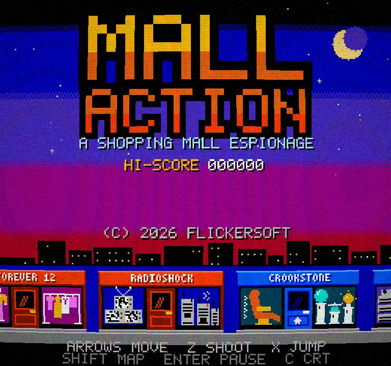
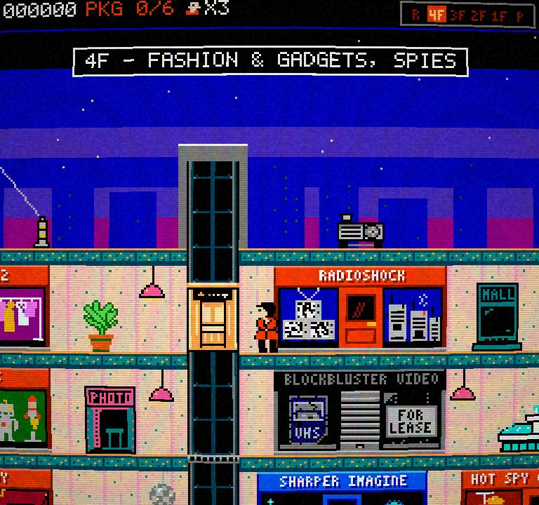
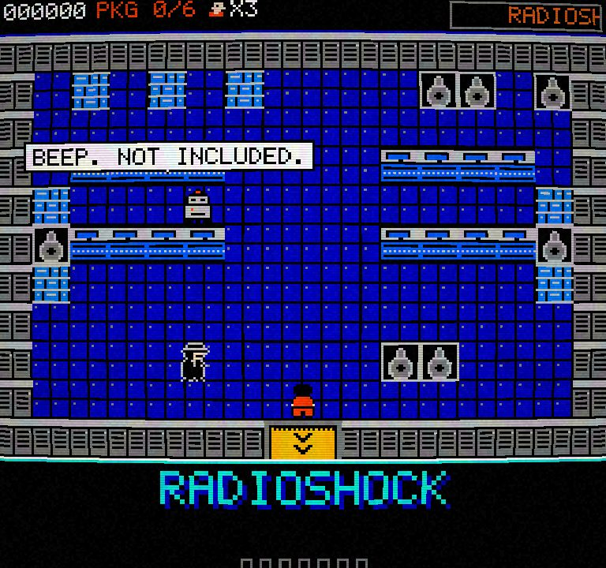
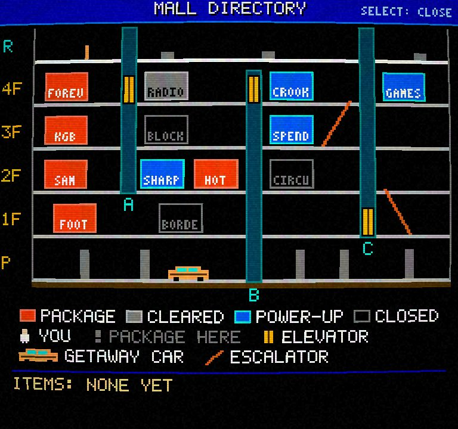
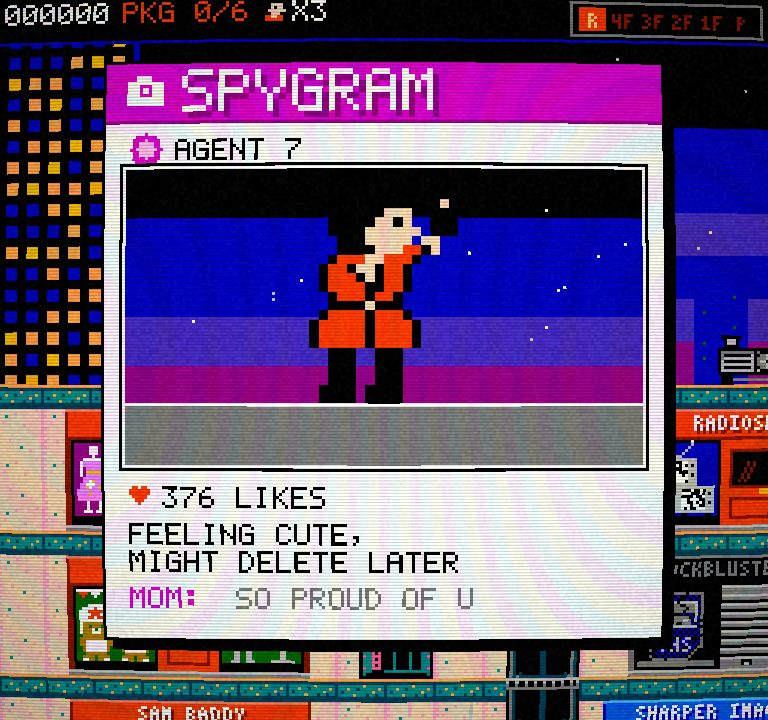
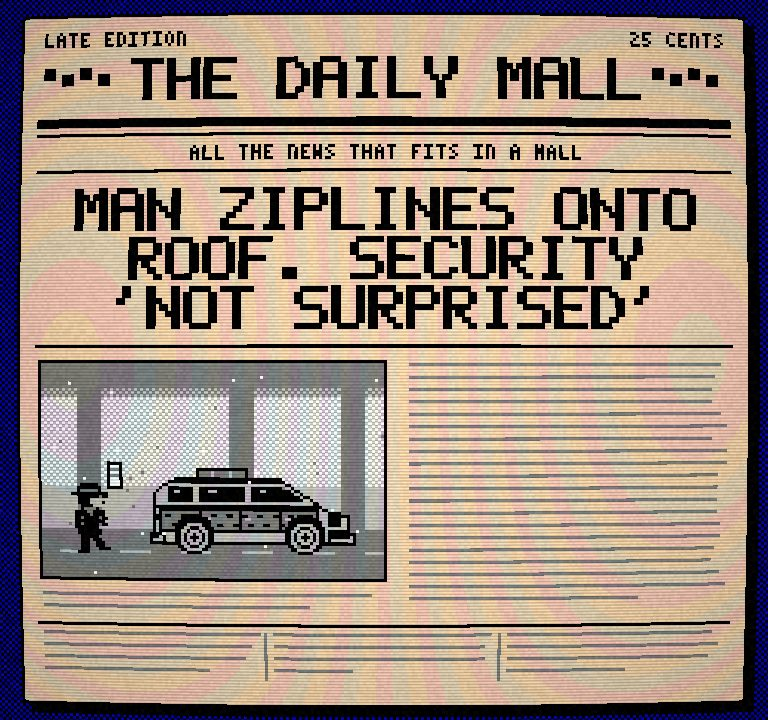
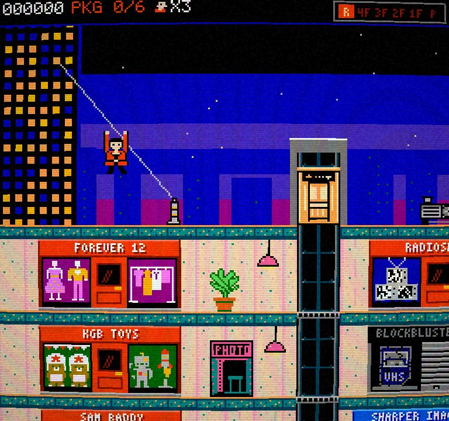
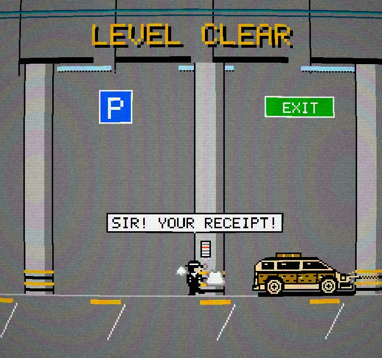

# MALL ACTION

**An 8-bit spy caper in an 80s shopping mall.** A spiritual successor to *Elevator Action*, by the fictional studio
**FLICKERSOFT**. Zip-line onto the roof, ride the elevators, shoot spies, search the stores for hidden packages, and
drive away in the wood-panelled getaway wagon. Then do it all again, harder.

> **[Play in your browser](https://rlorca.github.io/mall-action/sonnet-5.5-fable-5.1/)** (desktop browser, keyboard or gamepad)

<p align="center">
  
  
  
  
  
  
  
  
</p>
<sub>Screenshots are taken from the real build in Chrome with the CRT effect on (<code>scripts/screenshots.ts</code>).</sub>


This branch is one entry of a benchmark: the same one-shot brief (`one-shot-prompt.md` on `main`) given to different
AI models. This implementation was built by **Claude Sonnet 5.5 with Claude Fable 5.1 as advisor**. See
[Benchmark notes](#benchmark-notes).

## The game

Spies have hidden **6 packages** in 6 of the mall's stores. Collect them all, ride shaft **B** down to the parking level and
drive away. Then the next loop starts, harder.

* **The mall is a side-scroller** with six floors (R, 4F, 3F, 2F, 1F, P), three elevator shafts (A and B are driven by you, C
  runs on a timer), two escalators, a directory kiosk on every shopping floor, a photo booth, fountains, hanging lamps and
  2F disco balls.
* **Stores are top-down Zelda-style rooms.** Search shelves and racks for packages, power-ups, traps and nothing, while guards
  and security bots patrol.
* **13 storefronts** with animated window displays that show what they sell: red blinking doors hide a package, blue doors
  are power-up shops, rolled-down shutters are closed.
* **Chiptune everything:** two pulse waves, a triangle and noise, synthesised in the browser. One song per store, a quiet
  ambient bed for the mall, elevator muzak, an alarm groove. No audio files exist.
* **No art files either:** every sprite, tile, glyph and storefront is a character grid in source code.
* **CRT mode** (on by default) with scanlines, curvature, vignette and noise. Press **C** to toggle it.
* **Secrets:** enter the Konami code on the title screen. The GameStonk clerk has something dangerous to say.

## Controls

| Action | Keyboard | Gamepad |
|---|---|---|
| Move | Arrow keys, WASD | D-pad, left stick |
| A: shoot | Z, J | A (button 0) |
| B: jump (mall), search (store) | X, K, Space | B (button 1) |
| Select: mall directory map | Shift, Tab | Select (button 8) |
| Start: pause, confirm | Enter | Start (button 9) |
| CRT on/off | C | |
| Mute | M | |

Letter keys match the **printed letter** on your keycap, so QWERTZ and AZERTY layouts work; other keys match by position.

In the mall: **Up/Down** enters a store at its door, boards an elevator car standing at your floor (or calls it if you
stand in or beside the empty opening, or just stand still for half a second), rides an escalator from its landing, uses
a kiosk or the photo booth, and starts the getaway car. **Down** also ducks. Moving jumps are **jump-kicks** that kill spies.

## Tips

* Elevators are the only way between most floors. Hold Up/Down to move a car; let go between floors and it glides to the next floor.
* A car above you is a **grate** you can stand on, but if it comes down it crushes you. If you *called* it, it will pick you up.
* A car below is a **pit**: one floor down you land on its roof, further is fatal. Jump-kick over pits.
* Duck (Down) dodges high shots; jump over low ones. Spies telegraph with a half-second aiming pose.
* The directory kiosk points to the nearest package store. The photo booth hides you from spies.
* Armour (vest or pretzel) absorbs one hit. The Cinnabomb makes you invincible for 6 seconds.
* Shooting in front of the mall cop on his Segway gets you detained. Do not shoot the mall walkers either.
* After about 2.5 minutes the **alarm** goes off: spies are faster and more frequent.
* In a store, **tap B once** next to a fixture: the search runs on its own. Walk out of the door at the bottom to leave.

## Run it

```bash
npm install
npm run dev        # dev server at http://localhost:5173
npm test           # the rules test suite (Node only, no browser needed)
npm run typecheck
npm run build      # typecheck + production build into dist/ (relative URLs: works from any sub-path)
```

### Debug URL options

| URL | What it does |
|---|---|
| `?seed=N` | Fixes the random seed: the same seed and the same inputs replay identically |
| `?debug=1` | Skips the FLICKERSOFT splash and exposes `window.__mall` (see below) |
| `?debug=1&start=1` | Also skips the title and starts a run immediately (add `&skipintro=1` to skip the zip-line arrival) |
| `?gallery=1` | Every sprite, animated, paged with Left / Right |

`window.__mall` (with `?debug=1`): `step(frames, buttons)` runs N 60 Hz frames holding the buttons (`'RIGHT+A'` or a bit mask),
`tap(buttons)`, `state()` (scene, run, player, cars...), `shot()` (the exact framebuffer as a PNG data URL), `render()`, and
`realtime = false` to freeze the real-time loop so stepping is fully deterministic.

## Project layout

```
src/engine/     seeded RNG, fixed-step loop, input mapping + tap queue, NES palette, framebuffer, sprite pipeline, fonts
src/content/    DATA: stores, layout geometry, power-ups, ALL the jokes (copy.ts)
src/art/        sprites (character grids), storefront drawing
src/game/       THE RULES (pure, deterministic, no DOM): run, difficulty, mall world, store world, screens, scene machine
src/render/     draws the game state into the framebuffer, plus the WebGL / CRT presenter
src/audio/      pure song data + sequencer + NES-style Web Audio synth
src/flickersoft/  the reusable FLICKERSOFT studio splash (has its own README)
src/main.ts     browser bootstrap only
scripts/        PNG / contact-sheet / preview tools (npx tsx scripts/sheet.ts agent. out.png 4)
```

The rules never touch the DOM, `Math.random`, `Date` or `performance` (a test greps for them), time is counted in 60 Hz frames,
and the game advances through exactly one entry point, `game.step(pad)`. See [`AGENTS.md`](AGENTS.md) for the architecture,
the rules that must hold, and the gotchas.

### Where to add jokes

Everything the game says lives in [`src/content/copy.ts`](src/content/copy.ts): SPYGRAM posts, speech bubbles, last words,
PA announcements, headlines, floor banners, the GameStonk items and every UI label. Add a line to the right list. A test
(`src/content/content.test.ts`) fails if a line is too long for its slot (bubbles 28 characters, SPYGRAM captions 21 x 2 lines,
comments 21, headlines 26) or uses a glyph the font cannot draw.

## Disclaimer

MALL ACTION is a FLICKERSOFT fan homage. It is not affiliated with Taito or with any of the parodied brands; the store
names are puns and no logos or trade dress are used.

## Benchmark notes

| | |
|---|---|
| **Model** | Claude Sonnet 5.5 (`claude-sonnet-5-5`) as the executor, with **Claude Fable 5.1** (`claude-fable-5-1`) as the *advisor* (consulted through the harness `advisor` tool before the approach was committed to; its guidance is reflected in the software-framebuffer rendering, device-pixel integer scaling, the key-release-by-code input design, the 3x5 sign font and the early end-to-end slice). |
| **Branch** | `sonnet-5-5-fable-5-1` (orphan), published to `/sonnet-5.5-fable-5.1/` |
| **Date** | 2026-10-08, about 21:19 to 23:10 CEST (about 1 h 50 min wall clock) |
| **Harness** | Claude Code 2.1.294 (CLI), default reasoning effort (not overridden) |
| **Parallelism** | After the foundation (engine, content contracts, `Run`, architecture doc) was written and committed, the self-contained modules were delegated to 8 `general-purpose` subagents with strict file ownership, all inheriting Sonnet 5.5 (no model override): audio, characters/items art, mall-props art, storefront art, store-theme art, store rules + renderer, screens/HUD/splash, and mall NPCs/lights. The mall core, spies, level orchestration, Game scene machine, mall renderer, WebGL/CRT presenter, browser shell, CI and docs were written by the main session. |
| **Human interventions** | None beyond the one instruction (follow the brief, create a dedicated branch). No design steering. |
| **Size** | about 20k lines of source and 9k lines of tests; 751 tests in 45 files; production bundle about 286 kB (94 kB gzip) |

**What was verified, and how**

* `npm test` (751 tests, Node only), `npm run typecheck`, `npm run build`.
* A **scripted player** (`src/game/bot.ts`, presses buttons only) completes the game in the test suite: title, zip-line arrival, all six
  stores, parking, level clear, loop 2. It found a real bug (an invisible shaft wall on floors a shaft does not serve) that unit tests had missed.
  The same bot runs in the real page (`__mall.bot`).
* **Real Chrome with the CRT on** (Playwright driving the installed Chrome, `scripts/playtest-*.ts`): the splash, title, arrival and selfie,
  riding an elevator with real key events, shooting, entering stores and finding packages, the map, pause, level clear, continue,
  game over, Konami/Black Friday, the alarm, CRT and mute toggles (and their persistence), resize and high-DPI integer scaling,
  a simulated gamepad plugged and unplugged mid-walk, the no-WebGL message, audio unlocking and per-scene music. The console stayed
  free of errors and warnings over a full playthrough of roughly 9,000 rendered frames. The build was served from a **sub-path**
  (`/mall-action/play/`) to prove the relative URLs.
* **Fairness on loop 1**, measured with scripted players over 40 seeds (`scripts/fairness-route.ts`, `scripts/fairness-store.ts`; the sensible-player
  bars are locked in by `src/game/mall/fairness.test.ts` and `src/game/store/fairness.test.ts`):
  * A *passive* agent that never shoots, ducks or dodges reaches the first 4F store door without dying in 40 of 40 seeds, but then loses a
    life in 33 of 40 searches of that store, and dies 2.4 times per ~45 s tour of all six floors (touched by spies 56 times, shot 42).
    Passive play is punished, by design.
  * A *sensible* agent (shoots spies that are in front of him, ducks aimed-high shots) dies 1.0 times per full tour of the mall (32 of 40 tours
    completed on the first try of that script) and reaches the 4F stores untouched in at least 90% of runs. A reflex player (sidesteps aim
    lines, shoots lined-up guards) finds the package in 77 to 100 percent of visits to each of the six target stores.
  * These are bots, not people: the "new player can find a package without dying on the first try" bar is met by a simple reflex player,
    but nobody has play-tested it with a human first-timer.

**Honest gaps**

* **Nobody has listened to the music.** The audio was verified numerically (every track renders, does not clip, the ambient mall bed is
  clearly quieter) and through the real synth in headless Chrome, but taste is untested. `npx tsx scripts/render-song.ts <id>` writes a WAV.
* The Chrome extension was not connected in this session, so the browser playtests used `playwright-core` against the locally
  installed Chrome (a dev-only dependency; CI does not use it).
* The gamepad path was tested with a faked `navigator.getGamepads`, not hardware.
* The GitHub Pages deployment itself was not exercised (nothing was pushed from this session); the workflow follows the repo's
  convention and the build was verified under a sub-path locally.
* The mall cop does not ride escalators, and his helmet pings also provoke him when shot from behind.
* Spy AI is intentionally simple (walk toward the agent, aim, shoot, 10% dodge); it is fair rather than clever.
