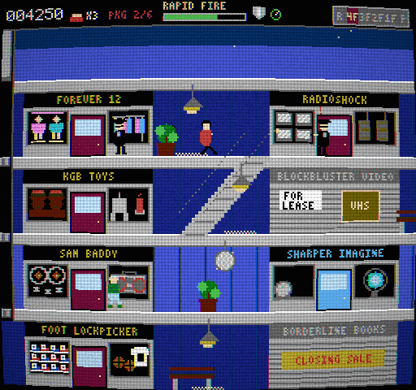
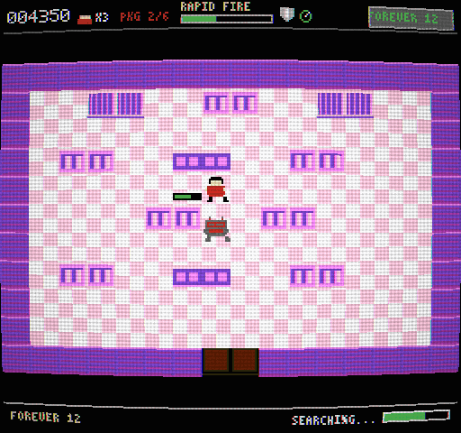
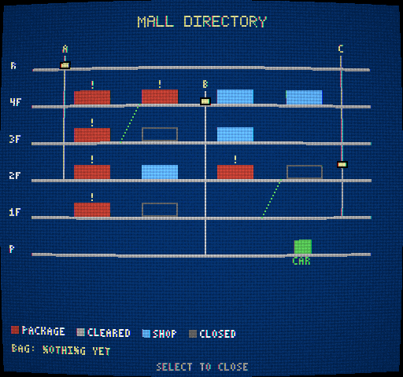

# MALL ACTION

**An 8-bit spy caper in an 80s shopping mall.** A **FLICKERSOFT** production.

Spies have hidden six packages in six stores. Zip-line onto the roof, work your
way down through the mall, search the fixtures while guards patrol, and get to
the parking level before the food court closes. Then do it again, harder.

A spiritual successor to Taito's *Elevator Action* (1983), with the corridors and
elevator shafts of a side-scroller and the fixture-searching of a top-down Zelda
room — set in a mall full of stores that are legally distinct from ones you may
remember.

### ▶ [Play in your browser](https://rlorca.github.io/mall-action/opus-5/)

| | |
|---|---|
|  |  |
|  |  |

---

## Features

- **Two games in one.** The mall is a side-scroller with floors, corridors,
  escalators and three elevator shafts. Walk through a store's door and it fades
  into a top-down room where you search the fixtures while guards close in.
- **Real elevators.** You drive the cars yourself. Release a direction and the
  car glides on to the next floor and stops level with it. Stand on a grate and
  a car coming down will crush you. Walk into an open shaft and you fall. One
  shaft runs on a timer, and one is the only way down to the parking level, so
  every run is a route-planning problem.
- **13 storefronts**, each with window displays that tell you what the store
  sells without reading the sign. Red doors blink where a package is hidden,
  blue doors are power-up shops, and three stores are shuttered for good.
- **Everything is generated from code.** Every sprite, tile, glyph, sound effect
  and piece of music is synthesised at load time. There is not a single art or
  audio asset in this repository.
- **A NES-shaped machine.** 256×240 at a fixed 60 Hz, a 64-entry master palette,
  at most 3 colours per sprite, and four synthesised audio channels: two pulses,
  a triangle and noise.
- **An arcade-monitor CRT effect** with scanlines, curvature, vignette and
  noise. On by default; `C` toggles it and the choice sticks.
- **Jokes throughout** — a parody photo app, mall PA announcements, a newspaper
  front page, a Zelda-cave easter egg, a mall cop on a Segway who will detain
  you, and two retirees in tracksuits who will absolutely not move.
- **Loops.** Clear the level and the next loop is faster, busier and alarms
  sooner. Three lives, three continues.

## Controls

| Action | Keyboard | Gamepad |
|---|---|---|
| Move | Arrows, WASD | D-pad, left stick |
| **A** — shoot | `Z`, `J` | A (button 0) |
| **B** — jump (mall) / search (store) | `X`, `K`, `Space` | B (button 1) |
| **Select** — map | `Shift`, `Tab` | Select (button 8) |
| **Start** — pause, confirm | `Enter` | Start (button 9) |
| CRT on/off | `C` | |
| Mute | `M` | |

Letter keys are matched by the **printed letter**, so QWERTZ and AZERTY
keyboards get the same physical layout as QWERTY without remapping anything.
Everything else matches by physical position.

## Tips

- **Jump while moving.** A standing jump is just a jump; a jump with forward
  momentum is a jump-kick that kills a spy on contact.
- **Duck.** Spies telegraph every shot with a half-second aiming pose, and they
  aim high or low. Holding Down dodges the high ones, and lets you shoot low.
- **Shoot the lamps.** A falling lamp kills anything underneath it and darkens
  that stretch of corridor. The 2F disco balls *roll* in the direction you shot
  from and flatten everything in the way — including you.
- **The elevator is a weapon.** Spies deliberately go and wait in shaft
  openings. Bring a car down on one for 300 points instead of 100.
- **Search is forgiving.** One tap of B starts it; it finishes on its own. Any
  fixture you are touching counts, including diagonally, and the agent turns to
  face it. Don't hold B — that won't chain into the next fixture.
- **Use the kiosks.** Up at a directory kiosk points you at the nearest store
  that still has a package. The Radar power-up marks them all on the map.
- **Shoot the fountains** for coins. One spray in twenty hides a gold coin worth
  an extra life.
- **Careful who you shoot.** The mall walkers cost you 200 points and block your
  bullets. Shooting in front of the mall cop gets you chased and detained.

## Running it

Node 18 or newer.

```bash
npm install
npm run dev       # dev server with hot reload
npm test          # the full rules test suite
npm run build     # typecheck + production build into dist/
npm run preview   # serve the production build
```

`npm run build` runs `tsc --noEmit` first, so a type error fails the build.

## Debug URL options

| Parameter | Effect |
|---|---|
| `?seed=N` | Fix the random seed. The same seed always replays the same game. A non-numeric seed is hashed, so `?seed=banana` works too. |
| `?debug=1` | Expose `window.MALLACTION` and skip the studio splash. |
| `?gallery=1` | Show every sprite in the game, animated, with its dimensions. |

They combine: `?debug=1&seed=7`.

Under `?debug=1`:

```js
MALLACTION.state                  // the live game state
MALLACTION.step(frames, buttons)  // run N frames with `buttons` held
MALLACTION.press(button, frames)  // tap a button, then release it
MALLACTION.Button                 // { Up, Down, Left, Right, A, B, Select, Start }
MALLACTION.readyToExit()          // jump to the getaway car with all 6 packages
```

`step()` runs the real simulation, so an automated playtest exercises exactly
the same code path as a player. See `AGENTS.md` for the playtest recipe.

## Project layout

```
src/
  core/          the game RULES - pure, no DOM, no rendering
    constants.ts   every timing, in FRAMES at 60 Hz
    rng.ts         seeded PRNG; all game randomness comes from here
    input.ts       virtual NES pad: key mapping, edge detection, tap queue
    loop.ts        fixed 60 Hz accumulator with a catch-up cap
    copy.ts        EVERY line of joke copy, with its length limits
    events.ts      the only channel from the rules to sound and rendering
    types.ts       the state shapes
    storeDefs.ts   the 13 storefronts and their room layouts
    mallLayout.ts  shafts, escalators, lamps, props, reachability
    level.ts       per-loop setup: what each fixture holds, difficulty
    mall.ts        the side-scrolling simulation
    store.ts       the top-down room simulation
    powerups.ts    slots and timers
    game.ts        the screen state machine
    konami.ts      the secret
  render/        drawing ONLY; reads state, never changes it
    palette.ts     the 64-entry master palette
    pixels.ts      Sprite (max 3 colours) and the indexed framebuffer
    font.ts        two pixel fonts, defined as ASCII art
    sprites.ts     the sprite catalogue
    displays.ts    storefront window displays
    tiles.ts       store room tiles, one set per theme
    mallScene.ts   / storeScene.ts / uiScene.ts / renderer.ts
    display.ts     integer scaling and the CRT shader
    gallery.ts     ?gallery=1
  audio/         synth.ts (NES channels), music.ts (tracks), sfx.ts
  flickersoft/   the reusable studio splash, with its own README
  main.ts        the browser shell: canvas, clock, listeners, audio device
tests/           the rules test suite
```

## Where to add jokes

**All player-facing joke copy lives in [`src/core/copy.ts`](src/core/copy.ts).**
One file. Add a line to the right array and it shows up in the game.

- SPYGRAM posts: `SPYGRAM_ARRIVAL` and `SPYGRAM_COMPLETE`
- Spy last words: `SPY_LAST_WORDS`
- Spies stepping out of an elevator: `SPY_ELEVATOR_LINES`
- Mall PA announcements: `PA_LINES`
- Newspaper headlines: `HEADLINES`
- First-visit store lines: `FIRST_VISIT_LINES`
- Useless easter-egg items: `JOKE_ITEMS`

Each array has a length limit at the top of the file, and
[`tests/copy.test.ts`](tests/copy.test.ts) fails if a line is too long or uses a
character neither font has. Run `npm test` after editing and the tests will tell
you if it won't fit on a 256-pixel screen.

Store names live in [`src/core/storeDefs.ts`](src/core/storeDefs.ts); they are
checked against the 80-pixel storefront width by the same test file.

## The FLICKERSOFT splash

[`src/flickersoft/`](src/flickersoft/) is a self-contained, reusable studio
ident — black screen, rainbow letters flickering on alternate frames like an NES
with too many sprites on a scanline, then a jingle and "PRESENTS". It has no
dependency on this game. See [its README](src/flickersoft/README.md) for how to
drop it into the next one.

## Continuous integration

Every push runs the tests and the production build, and deploys to GitHub Pages
only if both pass. A failing test blocks the deploy. See
[`.github/workflows/pages.yml`](.github/workflows/pages.yml).

## Disclaimer

MALL ACTION is a **FLICKERSOFT fan homage** to *Elevator Action*. It is not
affiliated with, endorsed by, or connected to Taito, or to any of the retailers
whose names are parodied here. Every store name is a joke; no real logos, trade
dress or brand names are used, and all art, music and sound are original and
generated from source code in this repository.

---

## Benchmark notes

This branch is one entry in the [MALL ACTION benchmark](https://github.com/rlorca/mall-action):
the same one-shot prompt (`one-shot-prompt.md` on `main`) given to different AI
models, each working autonomously from an empty directory.

| | |
|---|---|
| **Model** | Claude Opus 5 (`claude-opus-5`) |
| **Date** | 2026-09-29 |
| **Harness** | Claude Code CLI |
| **Reasoning / effort** | default |
| **Wall-clock** | ~1 h 10 m, one continuous session |
| **Result** | 217 tests passing; production build clean; full playthrough verified in a real browser |

### Interventions

Design was not steered — the brief was the only instruction. Two pieces of
harness plumbing were needed:

- Tool calls were approved interactively, as the benchmark rules allow.
- The Claude-in-Chrome extension was not connected, so the browser playtests
  were run by launching headless Chrome directly and driving it over the Chrome
  DevTools Protocol with a throwaway script. This changed *how* the game was
  tested, not what was built.

### What the browser playtest covered

Splash → title → zip-line arrival and SPYGRAM selfie → elevator and escalator →
shooting a spy and a lamp → entering a store, searching, finding a package and
leaving → map and pause overlays → all six packages and the exit on P → level
clear tally, newspaper, post, and a harder loop 2 → continue countdown → game
over. Plus three six-minute random-input soak runs, a sub-path production build,
the sprite gallery, and the CRT and mute toggles. No console errors in any run.

### Known rough edges

- Loop 2 replays the zip-line arrival and the arrival selfie. That reads as the
  level restarting, but a returning player may want to skip it faster.
- The mall corridor wallpaper is a busy vertical stripe at some floor colours.
- Guards in stores are competent enough that a player who never shoots will lose
  lives quickly — intended, but the difficulty ramp inside stores is less
  carefully tuned than the mall's.
