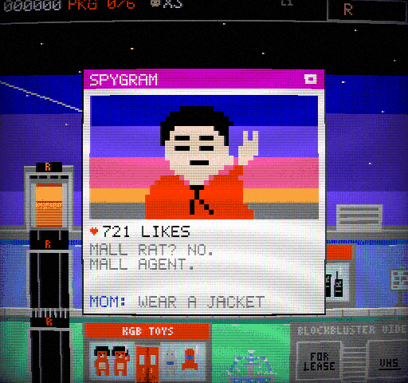

# MALL ACTION

**An 8-bit spy caper in an 80s shopping mall.** A FLICKERSOFT fan homage to Taito's *Elevator Action* (1983).

Spies have hidden **6 packages** in 6 stores of a big 1980s shopping mall. Zip-line onto the roof, take a selfie
(of course), ride the elevators and escalators, shoot out the lamps, dodge the mall cop's Segway, rummage through
Zelda-style store rooms, then drive off from the parking level in a wood-panelled station wagon. Then do it all
again, harder.

### [▶ Play in your browser](https://rlorca.github.io/mall-action/fable-5.1/)

| | | |
|---|---|---|
|  |  |  |
|  |  |  |

## Features

- **Side-scrolling mall**: 768 px wide, 6 floors (roof, 4F-1F, parking), 3 elevator shafts with different reach
  (A: R-2F manual, B: 4F-P manual and the only way to P, C: R-1F automatic), 2 escalators, 13 storefronts whose window
  displays show what they sell, and animated lamps, disco balls, fountains, kiosks and a photo booth.
- **Elevator Action rules**: grates you stand on when the car is above, pits when it is below, safe one-floor drops
  onto a car roof, crushing (spies for 300 points, or you), calling cars, gliding to the next floor, exactly one ding.
- **Top-down stores**: 10 hand-designed rooms in 9 themes, a forgiving one-tap search, guards (tile-walking spies
  and 3-hit security bots), traps, power-ups, and store gags: fitting-room spies, wind-up toys, a listening booth
  and a Zelda-cave easter egg.
- **People**: spies with a clear aiming pose, a janitor with a wet floor, power-walking retirees, and a mall cop on
  a Segway.
- **9 power-ups**, including three food-court specials (Cinnabomb, Orange Juli-Ooze, Soft Pretzel).
- **Humour**: SPYGRAM selfies, first-visit banter, spies' last words, mall PA announcements, and the front page of
  THE DAILY MALL.
- **Loops**: each loop has faster spies that appear and shoot more often, and the alarm comes sooner. The
  Konami code on the title screen turns on Black Friday Mode.
- **Presentation**: NES 256×240 with whole-number scaling, 3-colour sprites from a fixed NES palette, and a WebGL
  CRT effect. The chiptune soundtrack imitates the NES channels (2 pulse, triangle, noise) and has 19 original
  songs, including one per store. Every sprite, glyph, song and sound is generated from source code; the game
  loads no asset files.

## Controls

| Action | Keyboard | Gamepad |
|---|---|---|
| Move | Arrows, WASD | D-pad, left stick |
| A: shoot | Z, J | A (button 0) |
| B: jump (mall), search (store) | X, K, Space | B (button 1) |
| Select: map | Shift, Tab | Select (button 8) |
| Start: pause, confirm | Enter | Start (button 9) |
| CRT on/off | C | |
| Mute | M | |

Letter keys follow the printed letter, so QWERTZ and AZERTY keyboards work.

In the mall, **Up/Down** enters a store door, boards or calls an elevator, rides an escalator, and uses kiosks, the
photo booth and the getaway car. In an elevator, hold Up/Down to drive; Left/Right gets out at a floor.

## Tips

- From the roof, take **shaft A** (left) down one floor to reach the 4F stores fast.
- Stand still at a shaft opening for half a second and the car comes to you. When you call a car, it picks you
  up instead of crushing you. A car that is just passing through will still crush you.
- Spies freeze in an aiming pose for half a second before they fire, and they aim either high or low. Duck
  (Down) under high shots, or jump over low ones.
- Shoot a lamp when a spy is under it for 300 points. On 2F, the disco balls roll after they drop.
- Jump-kick (jump while moving) through spies. On the janitor's wet floor you keep kicking while you slide.
- **Never shoot in front of the mall cop.** Never shoot the mall walkers either; they just say "HEY!" and it
  costs you 200.
- Directory kiosks point to the nearest remaining package store. With Radar, the map marks every package store
  with a "!".
- Searching runs on its own after one tap of X, and it works on any fixture you are touching, in front of you or
  to either side.

## Run, test, build

```sh
npm install
npm run dev       # dev server (Vite), open the printed URL
npm test          # the whole rules test suite (Vitest, no browser needed)
npm run build     # type-check + static build into dist/ (relative URLs: works from any sub-path)
npm run preview   # serve dist/
```

### Debug URL options

| Option | Effect |
|---|---|
| `?seed=N` | Fixes the random seed: the same seed and inputs always replay the same game. |
| `?debug=1` | Skips the studio splash and exposes `window.__mall` = `{ game, seed, step(n, buttons), tap(buttons), freeze(on), crt(on), roomFor(id) }` for automated playtests. `step(60, ['right','a'])` runs 60 frames holding those buttons. |
| `?gallery=1` | Shows every sprite, animated (arrows scroll). |

## Project layout

```
src/
  core/      engine: fixed-step loop, seeded RNG, input mapping, NES palette, pixel-art pipeline, bitmap fonts
  game/      THE RULES (pure, no DOM): mall.ts, store.ts, elevator.ts, game.ts (screens/flow), layout.ts (the mall),
             rooms.ts (store templates), setup.ts, powerups.ts, difficulty.ts, copy.ts (ALL the jokes), state.ts
  render/    draws the state: gfx.ts (256x240 buffer), crt.ts (WebGL presenter + CRT shader), draw_*.ts, screens.ts
  audio/     synth.ts (WebAudio NES-style synth), songs.ts / sfx.ts (music and sound as text), notation.ts
  art/       every sprite as text rows (art_chars, art_items, art_tiles, art_displays) + manifest.ts
  splash/    the reusable FLICKERSOFT splash (own README)
  main.ts    browser glue: input, loop, audio events, debug API
tests/       Vitest suites for every rule in the brief
```

## Where to add jokes

All copy lives in **`src/game/copy.ts`**: SPYGRAM posts, first-visit lines, last words, elevator lines, PA
announcements, headlines, joke items and banners. Edit it freely. `tests/copy.test.ts` fails if a line gets too long
for its box: speech bubbles 28 characters, SPYGRAM captions 21 (2 lines), comments 21, headline lines 26.

## Benchmark notes

- **Model:** Claude Fable 5.1 (`claude-fable-5-1`)
- **Date:** 2026-09-29
- **Harness:** Claude Code 2.1.284, default reasoning settings
- **Duration:** about 1 hour for the one-shot build (15:44-16:50 CEST), including browser playtests
- **How it was built:**
  - The main agent wrote the engine, the rules, the renderer and the tests.
  - Two forked sub-agents, working to contracts the main agent defined first (`art/manifest.ts`,
    `audio/types.ts`, `audio/ids.ts`), wrote the pixel art and the music/SFX in parallel.
- **Interventions:**
  - None on the design. The user asked for a dedicated branch and pointed out that port 5173 was taken; the dev
    server used 5199.
  - The Claude-in-Chrome extension was not connected, so the browser playtests drove headless Chromium through
    Playwright (SwiftShader WebGL, CRT on), using both real-time key presses and the `?debug=1` stepping API.
- **Deviation from the brief:** CI publishes on pushes to this branch (`fable-5-1`), not `main`, because this repo
  keeps each model's build on its own branch (see `AGENTS.md` on `main`).

## Disclaimer

MALL ACTION is a FLICKERSOFT fan homage. It is not affiliated with or endorsed by Taito or by any brand parodied in
the game. All names are puns, and all art, music and code are original.
