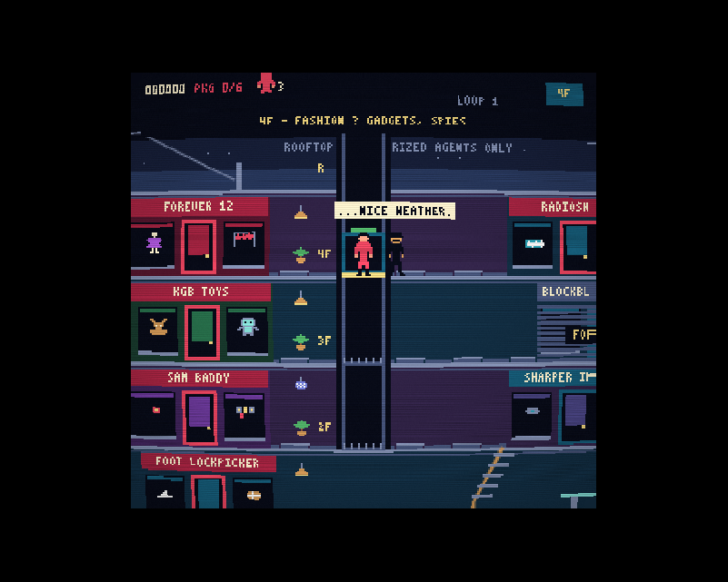
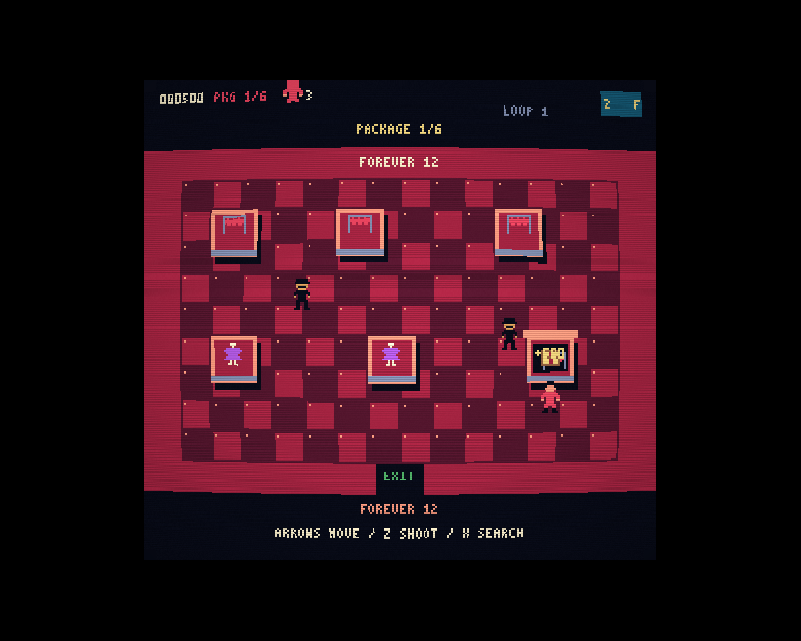

# MALL ACTION

An 8-bit spy caper in an 80s shopping mall, by fictional studio **FLICKERSOFT**. Ride elevators, dodge trench-coat trouble, rummage through parody stores for six hidden packages, and escape in a wood-panelled station wagon. The next loop turns up the pressure.

[Play in your browser](https://rlorca.github.io/mall-action/gpt-6.1-sol/)




- A scrolling six-floor mall with three elevators, shaft hazards, escalators and thirteen storefronts.
- Ten top-down shops with nine visual themes, persistent searches, guards, bots and store-specific surprises.
- Source-generated sprites, fonts, original music and sound; no downloaded art or audio.
- CRT arcade-monitor effect, seeded simulation, keyboard and gamepad controls.
- Packages, power-ups, mall walkers, a Segway cop, wet floors, fountains, a photo booth and plenty of spy jokes.
- SPYGRAM selfies, THE DAILY MALL, Black Friday mode, three continues and increasingly difficult loops.

## Controls

| Action | Keyboard | Gamepad |
|---|---|---|
| Move | Arrows / WASD | D-pad / left stick |
| Shoot | Z / J | A |
| Jump / search | X / K / Space | B |
| Map | Shift / Tab | Select |
| Start / pause / confirm | Enter | Start |
| CRT | C | — |
| Sound | M | — |

Letter bindings follow the printed letter on QWERTZ and AZERTY keyboards. Audio starts after the first input. CRT starts on and remembers your preference.

## Tips

Red blinking doors contain packages; blue doors sell power-ups. Press Up at a door. Tap X once while touching a fixture; the search finishes automatically. Hold Down to duck high shots. Jump while moving to kick spies. Exit a store through the bottom door.

Board an elevator with Up or Down and hold the direction to drive. Release to glide to a floor; press Left or Right while stopped to exit. Press Up/Down beside an empty shaft to call the car, or wait half a second. Shaft A reaches roof–2F; B reaches 4F–parking; automatic C reaches roof–1F. Parking is accessible only through B. Open pits are dangerous!

Collect all six packages, then press Up by the wagon on P. The map helps plan your route; Radar shows remaining package stores and their fixtures. Try the classic Up Up Down Down Left Right Left Right B A code on the title screen.

## Development

Requires Node 22.12+ (or Node 20.19+) and npm.

```sh
npm ci
npm run dev
npm test
npm run build
```

The static output is `dist/`. Vite uses relative asset URLs and works under `/mall-action/gpt-6.1-sol/`. No backend is required.

URL options: `?seed=42` reproduces setup; `?debug=1` skips the ident and exposes `window.mallAction`; `?gallery=1` cycles through source-generated sprites. Combine options with `&`.

For controlled simulation set `mallAction.running=false`, then call `mallAction.step(60, {right:true}, {a:true})`; the third argument contains first-frame press edges. Resume with `mallAction.running=true`. Browser verification uses actual key events; the exported `run` function in `scripts/browser-playtest.mjs` accepts a live Playwright page, server URL and screenshot directory.

`src/game.ts` holds rules, `core.ts` holds runtime/input, `data.ts` holds layouts, `art.ts` generates sprites/fonts, `render.ts` draws, `audio.ts` synthesizes, `crt.ts` presents and `main.ts` wires the browser. `src/splash` is a reusable module with its own README. Edit jokes in **`src/copy.ts`**; length tests protect dialogue and cards.

The branch workflow tests, builds and publishes `gpt-6.1-sol/` on `gh-pages`, preserving other benchmark implementations and adding its landing-page link. Failing checks block deployment.

## Benchmark notes

- Model: **GPT-6.1 Sol**, API model id `gpt-6.1-sol`; Codex desktop/API tool harness.
- Date: September 29, 2026; independent orphan branch `gpt-6-1-sol`.
- Reasoning effort: inherited harness setting, not explicitly exposed. Work performed by one agent.
- Interventions: user corrected the branch/folder name to include `6.1` and `sol`; sandbox approvals for worktree creation, dependency installation, local server and Git publication. A daemon restart interrupted the run; work resumed from disk.
- No code from another game's implementation was used. The repository-required publication workflow was copied and adapted.
- Verification and elapsed run time are recorded in `verification.md`. Browser scenarios use real-time controls, with debug placement for isolated interactions and later package stores; they are not a claim of an uninterrupted manual six-store route.

A **FLICKERSOFT fan homage**, not affiliated with Taito or any parodied brand. All music and art are original source-generated material.
