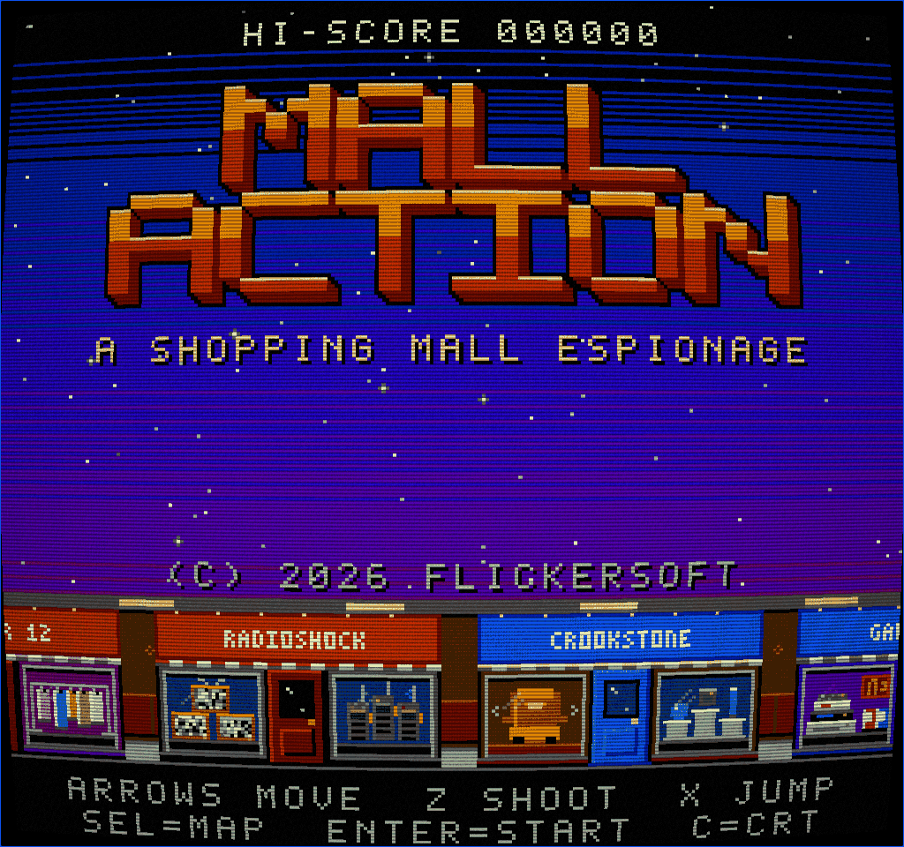
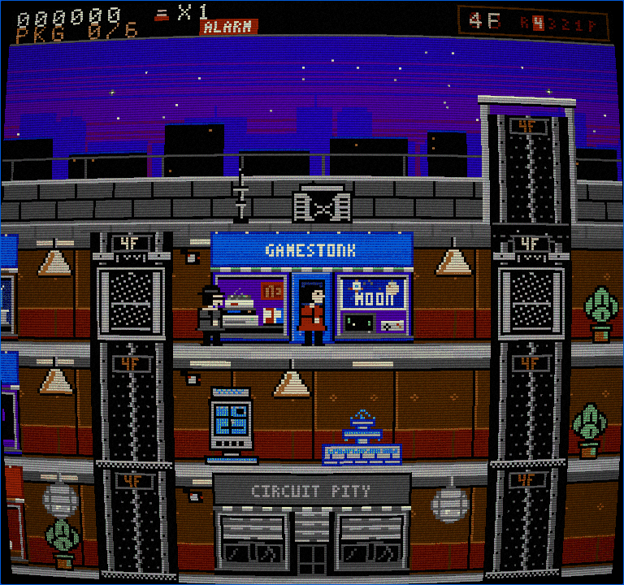
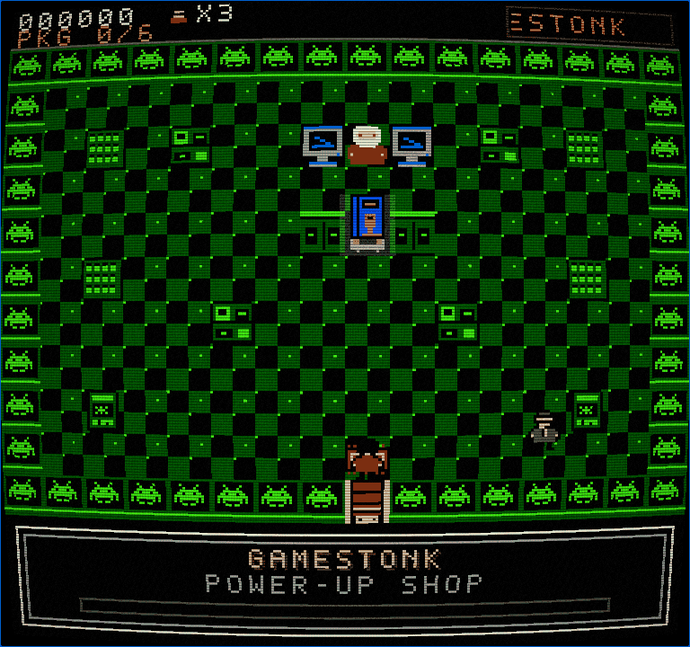
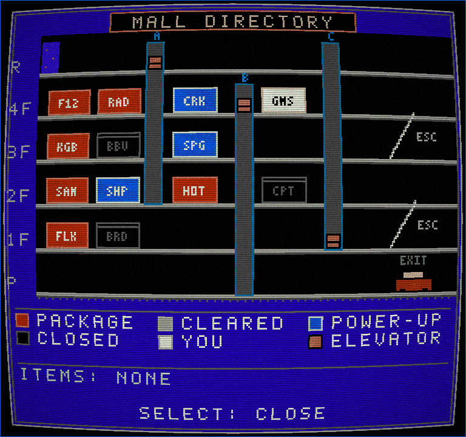
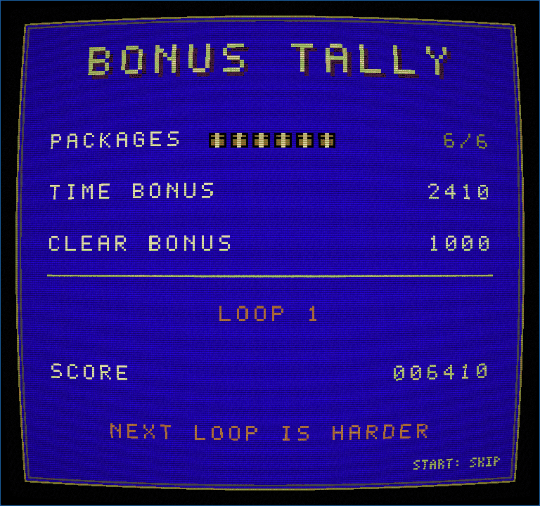
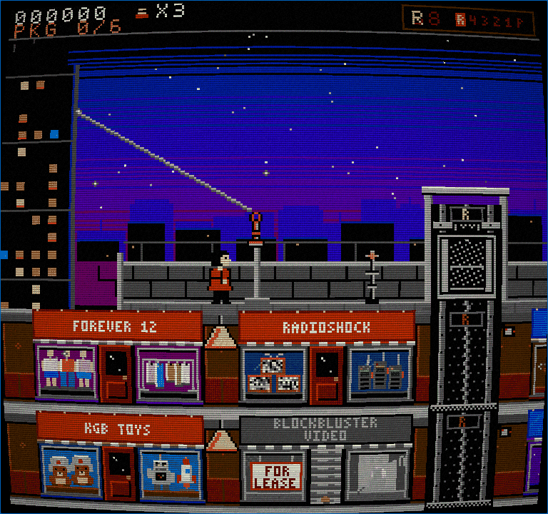

# MALL ACTION

*A shopping mall espionage.* An 8-bit spy caper set in an 80s shopping mall, by **FLICKERSOFT**.
A spiritual successor to *Elevator Action*: ride elevators and escalators, shoot spies, duck into
stores (top-down, Zelda-style) and search fixtures for the 6 hidden packages, then make it to the parking
level and drive off in the wood-panelled getaway wagon. Then the next loop starts, harder.

**[Play in your browser](https://rlorca.github.io/mall-action-sonnet/)** (deployed to GitHub Pages on every push to `main`)








## Features

- Side-scrolling mall: 6 floors, 3 elevator shafts (2 manual, 1 automatic), 2 escalators, 13 parody storefronts with animated window displays
- Top-down store rooms: 10 hand-designed layouts across 9 visual themes, forgiving one-tap searching, guards, traps, fitting rooms, wind-up toys, a Zelda-cave easter egg
- Spies, mall walkers, a janitor with a wet floor, a Segway mall cop, falling lamps, rolling disco balls, fountains, a photo booth, a mall alarm
- Power-ups (and food power-ups), loops that get harder, continues, Black Friday mode (Konami code on the title screen)
- Everything is generated from code: sprites, tiles, fonts, chiptune music (2 pulse, triangle, noise) and sound effects. No external assets
- Fixed 60 Hz simulation, integer-scaled nearest-neighbour rendering, optional CRT shader (C to toggle)

## Controls

| Action | Keyboard | Gamepad |
|---|---|---|
| Move | Arrows, WASD | D-pad, left stick |
| A: shoot | Z, J | A (button 0) |
| B: jump (mall), search (store) | X, K, Space | B (button 1) |
| Select: map | Shift, Tab | Select (button 8) |
| Start: pause, confirm | Enter | Start (button 9) |
| CRT on/off | C | |
| Mute | M | |

Letter keys match the printed letter, so QWERTZ and AZERTY layouts work.

## Tips

- Up/Down at a store door enters it. Red blinking doors hold packages, blue doors sell power-ups.
- Stand still in an empty elevator opening for half a second and the car comes to you.
- Jump + a direction is a jump-kick. Holding Down ducks under high shots.
- Shoot fountains for coins. Don't shoot the mall walkers. Don't shoot in front of the mall cop.
- Select opens the mall directory map; kiosks point to the nearest remaining package.

## Develop

```sh
npm install
npm run dev        # dev server
npm test           # vitest (rules, input, art data, audio data, copy limits, session flow)
npm run build      # typecheck + static build into dist/ (works under any sub-path)
```

### Debug URL options

- `?seed=N` fixes the random seed
- `?debug=1` skips the splash and exposes `window.__mall = { ctx, step(frames, buttons) }` to step the game N frames with buttons held
- `?gallery=1` shows every sprite, animated (left/right to page)
- `?input=1` shows a live view of the virtual pad along the bottom (yellow = keyboard, red = gamepad, `PADS:n` = devices the browser reports), for diagnosing input problems

### Project layout

```
src/core/         fixed-step loop, input (keyboard+gamepad), CRT presenter, scaling, RNG, events, palette
src/game/         PURE rules: mall/, store/, progress, difficulty, session (no DOM, no audio)
src/art/          pixel-art pipeline, fonts, sprites, tiles, storefronts, backdrops, logo, gallery
src/audio/        synth + sequencer (pure data) and the WebAudio layer
src/render/       drawing the mall, the stores, the HUD, banners/overlay
src/screens/      title, map, pause, level clear, SPYGRAM, continue, game over
src/flickersoft/  reusable FLICKERSOFT splash module (see its README)
src/data/         store table and ALL joke copy (copy.ts)
tests/            vitest suites
*-preview.html    dev-only harnesses (mall / store / screens / storefronts) served by `npm run dev`
```

### Where to add jokes

All player-facing copy lives in **`src/data/copy.ts`** (SPYGRAM posts, spy last words, first-visit lines,
PA announcements, headlines, ...). `tests/copy.test.ts` checks that every line fits on screen.

## Disclaimer

MALL ACTION is a FLICKERSOFT fan homage. It is not affiliated with, endorsed by, or connected to Taito or
any parodied brand. All store names are puns; no real logos or trade dress are used.
