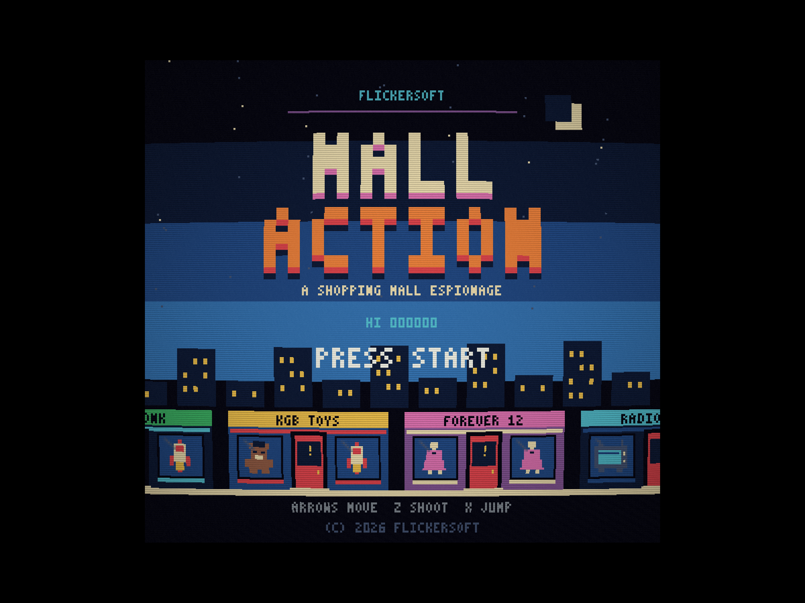
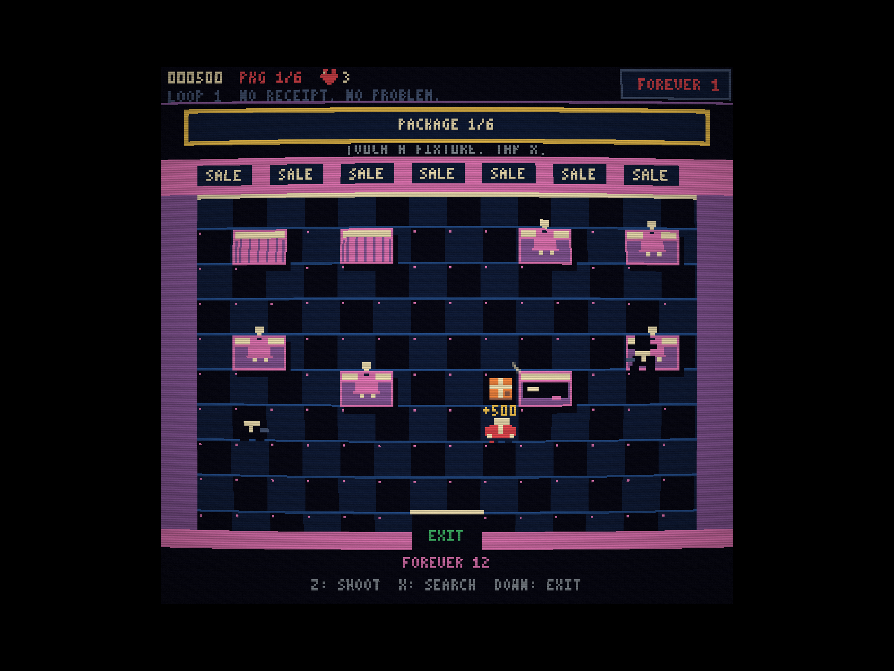

# MALL ACTION — GPT-6 Astra

**Six packages. One wood-panelled getaway wagon. Absolutely no receipts.**

A source-generated 8-bit spy caper from fictional studio **FLICKERSOFT**. Explore a six-floor, three-screen-wide 1980s mall, drive elevators, dodge agents, and enter parody stores that become top-down search-and-shoot rooms.

**[Play in your browser](https://rlorca.github.io/mall-action/gpt-6.astra/)** · [Implementation branch](https://github.com/rlorca/mall-action/tree/gpt-6-astra)




## Features

- Fixed 60 Hz simulation with deterministic seeded randomness, separate rendering, and capped catch-up.
- 256×240 pixel-art screen, integer scaling, source-generated font and sprites, and an optional WebGL CRT monitor effect enabled by default.
- Three elevators with different service ranges, calling, automatic travel, grate/pit rules, roof riding, and crushing hazards; two escalators.
- Thirteen parody storefronts and ten hand-authored interiors, with persistent fixture searches, guards, bots, traps, power-ups, and six packages.
- Falling lamps, rolling disco balls, fountains, a janitor, wet floors, mall walkers, a Segway cop, kiosks, and a photo booth.
- Nine power-ups, stacking slots, three continues, an extra life at 20,000 points, alarms, escalating loops, and secret Black Friday mode.
- SPYGRAM selfies, guard banter, PA announcements, a GameStonk cave scene, and THE DAILY MALL.
- Original synthesized music for every open store, title, alarm, elevator and listening booth, plus generated sound effects.
- Keyboard and hot-pluggable gamepads. No downloaded art, audio, fonts, runtime libraries, analytics, or backend.

## Controls

| Action                     | Keyboard       | Gamepad            |
| -------------------------- | -------------- | ------------------ |
| Move / interact / elevator | Arrows or WASD | D-pad / left stick |
| Shoot                      | Z or J         | A / button 0       |
| Jump / tap to search       | X, K or Space  | B / button 1       |
| Directory map              | Shift or Tab   | Select / button 8  |
| Start / pause / confirm    | Enter          | Start / button 9   |
| Toggle CRT                 | C              | —                  |
| Toggle sound               | M              | —                  |

Letter bindings follow the printed letter, including QWERTZ and AZERTY layouts. Audio starts after input. CRT preference persists; the high score is kept for the browser session.

## Tips

Start with the red doors on 4F. Walk right to elevator A, press Down to board, then hold Down briefly and release: the car finishes its trip to the next floor. Exit left or right when it stops. Holding Down continuously takes you through multiple floors.

Inside a store, touch a fixture and tap X once. Let the progress bar finish. A fresh different direction or a shot cancels the search. Packages stay collected if you die. Cleared target stores close; blue-door shops remain available.

Use Shift to plan your route. A reaches R–2F, B reaches 4F–P, and automatic C reaches R–1F. **Only B reaches the parking garage.** Stand next to an empty shaft and press Up/Down to call it, or wait half a second. Be careful shooting lamps directly above your route, particularly disco balls on 2F. Mall walkers cost points when shot. Shooting constantly is expensive!

## Run, test, build

Requires Node.js 20 or newer for development; the hosted game only needs a modern desktop browser with WebGL and Canvas support.

```sh
npm ci
npm test
npm run dev       # http://127.0.0.1:4173
npm run build     # self-contained static files in dist/
npm run preview  # serve dist/ on port 4173
```

There are no package dependencies. `PORT=4174 npm run dev` selects another local port. All build imports and links are relative, so the game works under a sub-path.

The branch's CI runs `npm ci`, `npm test`, and `npm run build`, then publishes only `gpt-6.astra/` on `gh-pages`. It uses the repository's shared `pages-publish` concurrency group and adds its landing-page link through a generator script. This deliberately follows the benchmark repository's branch-specific deployment convention rather than adding game code or workflows to `main`.

## Debug and testing

- `?seed=7` fixes the seed; the default is also 7.
- `?debug=1&seed=7` skips the splash and exposes `window.mall`.
- `?gallery=1` animates every sprite in a paged atlas.

```js
mall.stop(); // stop live simulation
mall.step(60, ["right"]); // 60 frames; fresh press on the first frame
mall.step(1, ["select"]); // open the directory
mall.state; // explicit simulation state
mall.rules; // pure, browser-independent rule functions
mall.start(); // resume live keyboard/gamepad play
```

The debug interface exists only when requested. `scripts/browser-playtest.js` supplies live keyboard helpers for local browser automation, using actual key events and animation frames rather than deterministic stepping. The unit suite covers input layouts and ordered tap queues, fixed time steps, deterministic replay, sprites, room reachability, physics, elevators, AI fairness, combat, NPCs, scoring, power-up timers, searching, extras, continues, screen transitions, copy limits, and renderer immutability.

## Project layout

| Path            | Responsibility                                                 |
| --------------- | -------------------------------------------------------------- |
| `src/rules.js`  | Browser-independent frame-based rules and events               |
| `src/data.js`   | Mall layout, hand-authored rooms, themes and songs             |
| `src/copy.js`   | Jokes, headlines, posts, dialogue and UI copy — add jokes here |
| `src/art.js`    | Indexed three-colour sprites, master palette and pixel font    |
| `src/render.js` | Read-only scene rendering                                      |
| `src/crt.js`    | Full-screen monitor shader and integer window scaling          |
| `src/audio.js`  | Two pulse voices, triangle, generated noise and jingles        |
| `src/input.js`  | Keyboard/gamepad merge, ordered taps, Konami and fixed loop    |
| `src/main.js`   | Browser lifecycle, audio unlock, storage and debug adapter     |
| `src/splash/`   | Independent reusable FLICKERSOFT ident with its own README     |
| `test/`         | Node's built-in test runner; no browser needed                 |
| `scripts/`      | Static build/server, live playtest helpers, landing generator  |

## Benchmark notes

- **Model:** GPT-6 Astra, identified by the user as the Astra run; branch/model label `gpt-6-astra`.
- **Date:** 9 October 2026.
- **Harness:** Codex workspace/API session; installed CLI reports `codex-cli 0.160.1`. Exact model revision and reasoning-effort setting are not exposed to this session.
- **Duration:** approximately 40 minutes for implementation, tests, live browser QA, documentation and publication checks.
- **Isolation:** independent orphan history and an initially empty worktree. No other implementation's game source was used. The existing publication workflow was copied as instructed by the repository.
- **Protocol deviation:** this began in the existing repository conversation rather than a fresh model session containing only the one-shot prompt. The shared prompt was read verbatim from `main` and left unchanged.
- **Human intervention:** the user corrected the model/branch identity to Astra early in the run. Routine sandbox approvals were needed for Git metadata, a local HTTP server, formatting, and network publication. No design guidance or sub-agents were used.
- **Verification:** 56 automated tests and the static production build pass. Real-time Chrome keyboard play, with CRT enabled, covered the opening, both escalators, manual elevator travel and calling, combat, falling lamps, all six package searches, escape on P, tally, newspaper, SPYGRAM, loop 2, map, pause, continue and game over. Screenshots were inspected and console errors checked.
- **Playtest assistance:** the opening through three packages was played without power grants. A discovered disco-ball respawn loop was fixed and regression-tested. The later coverage run resumed a continue fixture after that fix and used one debug-granted Cinnabomb for Hot Spy on a Stick. It therefore demonstrates the full playable route and scene coverage, not an unassisted perfect run.
- **Bugs caught during the run:** photo-booth/escalator interaction overlap; hazards bypassing respawn immunity; chronological ordering of taps in a catch-up frame; fractional preview-sprite pixels; and SPYGRAM caption line spacing. These fixes are part of this initial implementation.

A **FLICKERSOFT fan homage**, inspired by _Elevator Action_. Not affiliated with Taito or any parodied brand. All game artwork and music are original and generated from source code.
